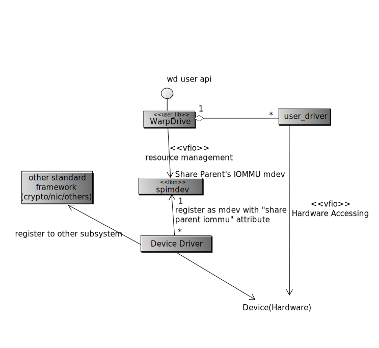
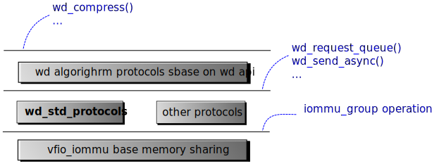

Introduction of WarpDrive
=========================
*WarpDrive* is a general accelerator framework built on top of vfio.
It can be taken as a light weight virtual function, which you can use without
SR-IOV like facility and can be shared with different processes.

It can be used as the quick channel for accelerators, network adaptors or
other hardware in user space. It can make some implementation simpler.
E.g. you can reuse most of the netdev driver and just share some ring buffer
to the user space driver for DPDK or ODP. Or you can combine the RSA
accelerator with the netdev in the user space as a Web reversed proxy, etc.

The name *WarpDrive* is simply a cool and general name meaning the framework
makes the application faster.

How does it work
================
The *WarpDrive* architecture is represented in the following class diagram:

                try to download and view it locally

The concept is simple. The *WarpDrive_k* provides a set of helper function to the
accelerator driver to export the device interface the user space via vfio-mdev
framework.

Therefore the *WarpDrive_u* can get the capabilities of the hardware and
require a queue, which is warpped as a getting queue command of vfio-mdev
device. So the *user_driver* can access the device via standard vfio interface.

We call WarpDrive_u and WarpDrive_k WarpDrive as a whole.

Capabilities and the device attribute
=====================================

The WarpDrive use the term, "capabilities", as the general concept for the
user application to use the hardware.

The term, capabilities, is the functions and feature that the accelerator can
provide.  When the accelerator driver register to the *WarpDrive_k*. It
provides its capabilities list, which is turned out to be attributes of the
supported_type_group.capabilities of a vfio-mdev type. The *WarpDrive_u*
library can search for the sysfs to locate all these capabilities and get
a queue to from the vfio-mdev parent device.

The *Capabilities* of a device is defined with:

        algo_type
                algorithm type, a unify string for all alogorithm

        flags
                feature of the algorithm, 32bit bitmask

Multiple devices can provide the same capability. The *WarpDrive_u* can make
the best choice according the to attributes of the accelerator/device. The
device attribute is defined in mdev_parent_ops.dev_attr_groups.dev_attr. It is
defined with:

        numa_zone
                The zone in which the device is.

        priority
                The priority of the device. from 1-100. Smaller is higher. A
                out of range value is taken as to disable the hardware from
                selecting.

See :ref:`queue-inquiry` for detail.

The user (*libwarpdrive*, or WarpDrive_u) interface
---------------------------------------------------
We adopt a polling style interface in the user space: ::

        int wd_request_queue(int container, struct wd_queue *q, struct wd_capa *capa);
        void wd_release_queue(struct wd_queue *q);

        int wd_send(struct wd_queue *q, void *req);
        int wd_recv(struct wd_queue *q, void **req);
        int wd_send_sync(struct wd_queue *q, void *req);
        int wd_recv_sync(struct wd_queue *q, void **req);
Here in the API of wd_request_queue, VFIO container is exposed to users. This
means:
        1. While using VFIO APIs, user can call the above WD APIs to request a
           queue with the existing VFIO container, then, for example, the
           requested queue can share virtual address space with the exiting
           devices in the container. What's more, as you add more mappings to
           the queue, the other devices in the container can access the new
           mapped address too.
        2. Vice versa, while using WD APIs, user can using VFIO APIs to add
           devices into the container of the queue, and do relatives
           VFIO operations at the container.
        3. User also can request queue with a new container by input container
           with 'container <= 0'.
In a word, warpdrive queue is a new and light 'device' for vfio container.

The *wd_queue* may not directly refer to a hardware queue. It refers only to a
handle that the user application can get help from by sending request. So
the *user driver* may just reuse the same hardware queue for more than one
*wd_queue*. It all depend on the driver developers.

The hardware accelerator need to access the user memory space in many
cases. To share the memory with it, the user application can request queues
with capabilities with *WD_CAPA_SHARE_ALL* or it can share the memory with
explicit calls: ::

        int wd_mem_share(struct wd_queue *q, const void *addr, size_t size, int flags);
        void wd_mem_unshare(struct wd_queue *q, const void *addr, size_t size);

The *WD_CAPA_SHARE_ALL* is not imperative to all hardware types. Application
can request for it and downgrade if it is not supported.

More about the memory sharing
=============================
The *WarpDrive* framework adopt a cache coherent memory mode between the
application and the hardwares. So if the memory is shared, the devices and
user applications can access the memory at the same time.

The *WD_CAPA_SHARE_ALL* and *wd_mem_share* request create the sharing. They
may cause the target memory is pinned in place, or if the system and the
device support SVA, the memory will be loaded until the device raise a page
fault to the virtual memory.

The occasion of memory page allocation will effect the system performance a
lot. We leave this complexity to the hardware/driver developers and system
administrators. And keep the user interface simple.

The *wd_mem_share* interface is implemented with VFIO dma interface. But this
may not be safe according the gup documents[1]_. It is easy to prove by
madvice(MADV_DONTNEED) the memory after it is VFIO_IOMMU_MAP_DMA-ed. The gup
pin only the physical page, not the vma reference. But this should be the
problem of the VFIO system itself.

Synchronized and Asynchronized interface
========================================
The *WarpDrive* is designed without binding to any thread library. The
*wd_send* and *wd_recv* are asynchronized interface that add the request to
the queue and return without waiting for a result. If the queue is full or
empty, the call will return with an error code immediately.

This would be good enough for the application which dedicate the whole core
for polling. But if you need a interrupt driven application. The synchronized
interface can come to help. A read to the queue while hung the current thread
until its state is changed. So the application can always call the
*wd_send_sync* and *wd_recv_sync* by queue polling without syscall while it is
full and empty and hung the current thread and waiting for the queue state to
be updated.

The hardware queue can be strong or weak ordered. It is defined as a
capability, *WD_WEAK_ORDER*.

More about the VFIO and VFIO-mdev
=================================
The original VFIO is designed to share part or parts of function of a device
to a VM. So it requires the part of the function has it own hardware identity.
In PCIE standard, this identity is supposed referring to the requester ID.
This solution is clean, but expensive. It is hard for a accelerator to create
thousands of requesteres in the hardware space.

VFIO-MDEV can help on this situation. It creates its own iommu_group and do
DMA by itself. WarpDrive need the former rather than the later. A separated
iommu_group is necessary so it can be used by multiple applications. But the
DMA operation can still be conducted by its parents' iommu. The VFIO type1
driver need a little upgrade here.

Mdev is assumed to be created by the administrator. But hardware will not
be applied to it in WarpDrive. It is simply a handle for the application to
keep touch with the hardware driver. The hardware resource will be allocated
only when the FD of the device is acquired by VFIO interface. Application can
check if a WarpDrive mdev is available by its sysfs interface (todo: detail).

Multiple processes support
==========================
The current iommu (mainline kernel 4.17) framework do not support multiple
process to use the same iommu device. (the device used a separated request id)
We assume Jean's patch[4] will be adopted finally (We have tested it in our
hardware, which is known as D06). So WarpDrive will support multiple processes
(and SVA) to access.

But even without the feature. WarpDrive can still work for single process with
iommu, or work with multiple processes with vfio-noiommu.

Update needed to the other subsystem
====================================

* The vfio type1 driver need to be patched to use parent's iommu for warpdrive
  mdev.

.. _link: https://zhuanlan.zhihu.com/p/35489035

* Support *SVA*

  The SVA feature is now supported only on x86 now[2]_. But new
  patches is undertaken[3]_. Without SVA support there is hardly a way to
  implement *WD_CAPA_SHARE_ALL*.

Assumption to the hardware
--------------------------

The following assumptions are made to the hardware:

* The hardware IO space will be mapped to user space in *WarpDrive*, the
  hardware should provide mechanism for the user driver to

  * Send requests to the queue
  * Kick the queue for hardware reading
  * Send irq to notify the queue status change
  * Provide mechanism to change the irq frequency (optionally)

  The IO space between queues should stay in different pages, so they will not
  influence each other. But for those devices which create many queues, they
  can share the same io space but it should provide a method for the
  application so they should not effluence each other.

* Dynamical Queue Allocation

  Queue is the hardware interface to the user driver. It can be generated
  according to the request by the hardware driver. Or it can be generated upon
  the driver initialization.

  But the IO space is limited by the hardware design. Therefore, it is
  suggested to make the IO space dynamical,  so it can be used for different
  purpose.

* Interrupt Merging

  The number of queues is assumed to be up to 4096. To reduce the number of
  interrupt, *WarpDrive* adopts a napi-like polling mechanism. That is, the
  driver may mask all or some of interrupt notifications and polling all or
  some of the queues.

  This require the hardware provide interface to mask the notification
  interrupt.

* (opt) IOMMU

  IOMMU should be support to use VFIO. Or it has to be NOIOMMU mode, which
  make the kernel tainted.

Legacy Mode Support
===================
For compliant with some old devices which do not support IOMMU, the
*WarpDriver* supports *Legacy Mode*. It works only when VFIO-NOMMU mode is
available. Legacy mode is not encouraged. It is assumed only for testing or
some home-made solution.

Hardware Drivers
================
*WarpDrive* require hardware driver in the user land. It can be different
according to the communication protocol of the hardware. But it is not worthy
to have many driver for the same purpose.

We will define a "standard" protocol in the communication layer. The protocol
works on the following layer:

                try to download and view it locally

But it is not the immediately requirement.

todo...

References
==========
.. [1] Accroding to the comment in in mm/gup.c, The *gup* is only safe within a
       syscall.  Because it can only keep the physical memory in place without
       making sure the VMA will always point to it. Maybe we should raise the VM_PINNED
       patchset (see https://lists.gt.net/linux/kernel/1931993) again to solve
       this problem.
.. [2] see drivers/iommu/intel-svm.c
.. [3] http://www.spinics.net/lists/linux-pci/msg58650.html

.. vim: tw=78
