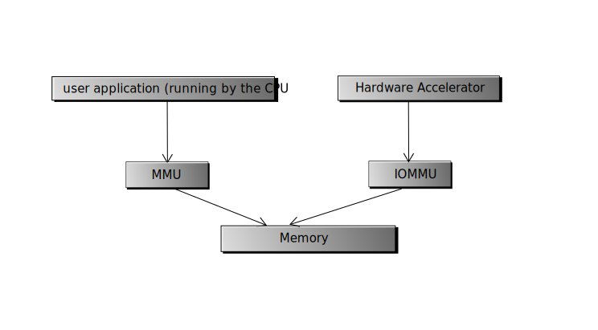

Introduction of WarpDrive
=========================

*WarpDrive* is a general accelerator framework built on top of vfio.
It can be taken as a light weight virtual function, which you can use without
*SR-IOV* like facility and can be shared among multiple processes.

It can be used as the quick channel for accelerators, network adaptors or
other hardware in user space. It can make some implementation simpler.  E.g.
you can reuse most of the *netdev* driver and just share some ring buffer to
the user space driver for *DPDK* or *ODP*. Or you can combine the RSA
accelerator with the *netdev* in the user space as a Web reversed proxy, etc.

The name *WarpDrive* is simply a cool and general name meaning the framework
makes the application faster. In kernel, the framework is called SPIMDEV,
namely "Share Parent IOMMU Mediated Device".

How does it work
================

*WarpDrive* takes the Hardware Accelerator as a heterogeneous processor which
can share some load for the CPU:

                try to download and view it locally

So it provides the capability to the user application to:

1. Send request to the hardware
2. Share memory with the application and other accelerators

These requirements can be fulfilled by VFIO if the accelerator can serve each
application with a separated Virtual Function. But a *SR-IOV* like VF (we will
call it *HVF* hereinafter) design is too heavy for the accelerator which
service thousands of processes.

And the *HVF* is not good for the scenario that a device keep most of its
resource but share partial of the function to the user space. E.g. a *NIC*
works as a *netdev* but share some hardware queues to the user application to
send packets direct to the hardware.

*VFIO-mdev* can solve some of the problem here. But *VFIO-mdev* has two problem:

1. it cannot make use of its parent device's IOMMU.
2. it is assumed to be openned only once.
   
So it will need some add-on for better resource control and let the VFIO
driver be aware of this.

Architecture
------------

The full *WarpDrive* architecture is represented in the following class
diagram:

.. image:: _static/wd-arch.svg
        :alt: This is a .svg image, if your browser cannot show it,
                try to download and view it locally

The idea is: when a device is probed, it can be registered to the general
framework, e.g. *netdev* or *crypto*, and the *SPIMDEV* at the same time.

If *SPIMDEV* is registered. A *mdev* creation interface is created. Then the
system administrator can create a *mdev* in the user space and set its
parameters via its sysfs interfacev. But not like the other mdev
implementation, hardware resource will not be allocated until it is opened by
an application.

With this strategy, the hardware resource can be easily scheduled among
multiple processes.

The user API
------------

We adopt a polling style interface in the user space: ::

        int wd_request_queue(int container, struct wd_queue *q,
                             const char *mdev)
        void wd_release_queue(struct wd_queue *q);

        int wd_send(struct wd_queue *q, void *req);
        int wd_recv(struct wd_queue *q, void **req);
        int wd_recv_sync(struct wd_queue *q, void **req);

the ..._sync() interface is a wrapper to the non sync version. They wait on the
device until the queue become available.

Memory can be done by VFIO DMA API. Or the following helper function can be
adopted: ::

        int wd_mem_share(struct wd_queue *q, const void *addr,
                         size_t size, int flags);
        void wd_mem_unshare(struct wd_queue *q, const void *addr, size_t size);

Todo: if the IOMMU support *ATS* or *SMMU* stall mode. mem share is not
necessary. This can be check with SPImdev sysfs interface.

The user API is not mandatory. It is simply a suggestion and hint what the
kernel interface is supposed to support.

The user driver
---------------

*WarpDrive* expose the hardware IO space to the user process (via *mmap*). So
it will require user driver for implementing the user API. The following API
is suggested for a user driver: ::

        int open(struct wd_queue *q);
        int close(struct wd_queue *q);
        int send(struct wd_queue *q, void *req);
        int recv(struct wd_queue *q, void **req);

These callback enable the communication between the user application and the
device. You will still need the hardware-depend algorithm driver to access the
algorithm functionality of the accelerator itself.

Multiple processes support
==========================

In the latest mainline kernel (4.18) when this document is written.
Multi-process is not supported in VFIO yet.

*JPB* has a patchset to enable this[2]_. We have tested it with our hardware
(which is known as *D06*). It works well. *WarpDrive* rely on them to support
multiple processes. If it is not enabled, *WarpDrive* can still work, but it
support only one process, which will share the same io map table with kernel
(but the user application cannot access the kernel address, So it is not going
to be a security problem)

Legacy Mode Support
===================
For the hardware on which IOMMU is not support, WarpDrive can run on *NOIOMMU*
mode.

References
==========
.. [1] Accroding to the comment in in mm/gup.c, The *gup* is only safe within
       a syscall.  Because it can only keep the physical memory in place
       without making sure the VMA will always point to it. Maybe we should
       raise the VM_PINNED patchset (see
       https://lists.gt.net/linux/kernel/1931993) again to solve this problem.
.. [2] https://patchwork.kernel.org/patch/10394851/
.. [3] https://zhuanlan.zhihu.com/p/35489035

.. vim: tw=78
