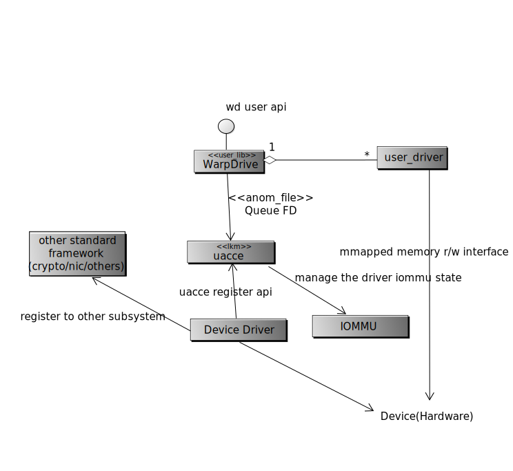

Introduction of WarpDrive
=========================

*WarpDrive* is a general accelerator framework for the user application to
access the hardware without going through the kernel.

It can be used as the quick channel for accelerators, network adaptors or
other hardware in user space. It can make some implementation simpler.  E.g.
you can reuse most of the *netdev* driver and just share some ring buffer to
the user space driver for *DPDK*[4] or *ODP*[5]. Or you can combine the RSA
accelerator with the *netdev* in the user space as a Web reversed proxy, etc.

The name *WarpDrive* is simply a cool and general name meaning the framework
makes the application faster. In kernel, the framework is called uacce,
meaning "Unified/User-space-access-intended Accelerator Framework".

How does it work
================

*WarpDrive* takes the hardware accelerator as a heterogeneous processor which
can share particular load from the CPU:

.. image:: wd.svg
        :alt: This is a .svg image, if your browser cannot show it,
                try to download and view it locally

So it provides the capability to the user application to:

1. Send request to the hardware
2. Share memory with the application and other accelerators

*WarpDrive* uses the concept, "queue", as the command channel between the user
process. From perspective of the user process, queue is a file handle
allocated by *WarpDrive*. The user process mmap the queue file and communicate
with the hardware by read/write to the mmapped space.

The mmapped space can be on the hardware mmio space or simply on shared memory
allocated by the hardware driver. A simple user driver is recommended to warp the
communication.

User process drops request to the hardware directly by writing message to the
queue mmapped space.

The message containing the request can directly use VA of the user process.
*WarpDrive* manages the IOMMU state of the device. If the IOMMU supports
SVA/SVM, it will enable it (NOT in the version yet). If it does not, the user
land need to explicitly "share" those memory by ioctl-ing to the queue file.

Architecture
------------

The full *WarpDrive* architecture is represented in the following class
diagram:

                try to download and view it locally

The user API
------------

We adopt a polling style interface in the user space: ::

        int wd_request_queue(struct wd_queue *q);
        void wd_release_queue(struct wd_queue *q);

        int wd_send(struct wd_queue *q, void *req);
        int wd_recv(struct wd_queue *q, void **req);
        int wd_recv_sync(struct wd_queue *q, void **req);

the ..._sync() interface is a wrapper to the non sync version. They wait on the
device until the queue become available.

If the queue do not support SVA/SVM. Or the following helper function
can be adopted: ::

        int wd_mem_share(struct wd_queue *q, const void *addr,
                         size_t size, int flags);
        void wd_mem_unshare(struct wd_queue *q, const void *addr, size_t size);

The user API is not mandatory. It is simply a suggestion and hint what the
kernel interface is supposed to support.

The user driver
---------------

*WarpDrive* expose the hardware IO space to the user process (via *mmap*). So
it will require user driver for implementing the user API. The following API
is suggested for a user driver: ::

        int open(struct wd_queue *q);
        int close(struct wd_queue *q);
        int send(struct wd_queue *q, void *req);
        int recv(struct wd_queue *q, void **req);

These callback enable the communication between the user application and the
device. You will still need the hardware-depend algorithm driver to access the
algorithm functionality of the accelerator itself.

Multiple processes support
==========================

In the latest mainline kernel (4.19) when this document is written, the IOMMU
subsystem do not support multiple process page tables yet.

Most IOMMU hardware implementation support multi-process with the concept
of PASID. But they may use different name, e.g. it is call sub-stream-id in
SMMU of ARM. With PASID or similar design, multi page table can be added to
the IOMMU and referred by its PASID.

*JPB* has a patchset to enable this[1]_. We have tested it with our hardware
(which is known as *D06*). It works well. *WarpDrive* rely on them to support
multiple processes. If it is not enabled, *WarpDrive* can still work, but it
support only one process, which will share the same io map table with kernel
(but the user application cannot access the kernel address, So it is not going
to be a security problem)

Legacy Mode Support
===================
For the hardware without IOMMU, WarpDrive can still work, the only problem is
VA cannot be used in the driver. The driver should adopt another strategy for
the shared memory.

The Folk Scenario
=================
If a process with allocated queues and shared memory, what happen if it forks
a child?

The fd will be duplicate on folk, so the child can send request to the same
queue as the parent. To avoid the child to use the queue again, any syscall to
the fd from pid other another the one who open the queue will be blocked.

And it is recommend to add O_CLOEXEC to the file.

The mmap to the mmio space should not be used by the child, so the VM_DONTCOPY
will be added to the mmap call. The child will not use those space.
VM_DONTEXPAND, VM_IO, can VM_DONTDUMP can also be added accordingly.

The shared memory should not be used by the child. There are 2 categories
here:

1. With SVM, the the memory is not shared at all, so it is not a problem.
2. With explicit mem_share api, the page is pinned and mapped by the iommu
   driver to the device. When clone, the page ref is added, and the parent and
   the child COW the page. The physical page may belong to the parent or the
   child. This become a problem.

   Mmu_notifier cannot solve this problem, it is monitoring the vma, not the
   page. It is the page is shared to the device. Those pages should not be
   cowed, they should be simply copied.

So where the virtual memory is shard, the uacce will set the range of VMA to
VM_SHARE. So it is known that the page may be used by some other user. This
can solve the problem.

Further, if the data is file backed, the driver gup and dmamap the page, it
also need the VM_SHARE flag to let the vmscan avoid mistreating the page.

References
==========
.. [1] https://patchwork.kernel.org/patch/10394851/

.. vim: tw=78
