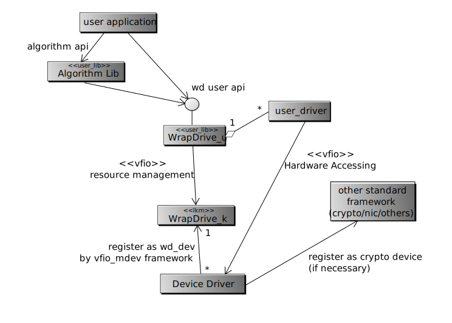

Introduction of WrapDrive
=========================
*WrapDrive* is intended to be a general framework built on top of vfio-mdev in
Linux kernel. It exposes a hardware "queue" by vfio-mdev to the user space
without necessity of VF support on the hardware.

It can be used as the quick channel for accelerators or network adaptors. It
will be good for accelerator framework such as CCIX[1]_

The name *WrapDrive* is simply a cool and general name meaning the framework
make the application faster. It is for easily reference. It may be changed if
people do not like it.

How does it work
================
The *WrapDrive* architecture is represented in the following class diagram:

                try to download and view it locally

The concept is simple. The *WrapDrive_k* provides a set of helper function to the
accelerator driver to export the device interface the user space via vfio-mdev
framework.

Therefore the *WrapDrive_u* can get the capabilities of the hardware and
required a queue, which is wrapped as a vfio-mdev device. So the *user_driver*
can access the device via standard vfio interface.

We call WrapDrive_u and WrapDrive_k WrapDrive as a whole.

Capabilities and the device attribute
=====================================

The WrapDrive use the term, "capabilities", as the general concept for the
user application to use the hardware.

The term, capabilities, is the functions and feature that the accelerator can
provide.  When the accelerator driver register to the *WrapDrive_k*. It
provides its capabilities list, which is turned out to be attributes of the
supported_type_group.capabilities of a vfio-mdev type. The *WrapDrive_u*
library can search for the sysfs to locate all these capabilities and allocate
a queue(vfio-mdev) form the vfio-mdev parent device.

The *Capabilities* of a device is defined with:

        algo_type
                algorithm type, a unify string for all alogorithm

        flags
                feature of the algorithm, 32bit bitmask

Multiple devices can provide the same capability. The *WrapDrive_u* can make
the best choice according the to attributes of the accelerator/device. The
device attribute is defined in mdev_parent_ops.dev_attr_groups.dev_attr. It is
defined with:

        numa_zone
                The zone in which the device is.

        priority
                The priority of the device. from 1-100. Smaller is higher. A
                out of range value is taken as to disable the hardware from
                selecting.

The user (*libwrapdrive*, or WrapDrive_u) interface
---------------------------------------------------
We adopt a epoll-like interface in the user space: ::

        int wd_request_queue(struct wd_queue *q, struct wd_capa *capa);
        void wd_release_queue(struct wd_queue *q);

        int wd_send(struct wd_queue *q, void *req);
        int wd_recv(struct wd_queue *q, void **req);
        int wd_send_sync(struct wd_queue *q, void *req);
        int wd_recv_sync(struct wd_queue *q, void **req);

The *wd_queue* may not directly refer to a hardware queue. It refers only to a
handle, that the user application can get help from it by sending request. So
the *user driver* may just reuse the same hardware queue for more than one
*wd_queue*. It is all depend on the driver developers.

The hardware accelerator will need to access the user memory space in many
cases. To share the memory with it, the user application can request queues
with capabilities with *WD_CAPA_SHARE_ALL* or it can share the memory with
explicit calls: ::

        int wd_mem_share(struct wd_queue *q, const void *addr, size_t size, int flags);
        void wd_mem_unshare(struct wd_queue *q, const void *addr, size_t size);

The *WD_CAPA_SHARE_ALL* is not imperative to all hardware types.

More about the memory sharing
=============================
The *WrapDrive* framework adopt a cache coherent memory module between the
application and the hardware. So if the memory is shared. The device and the
user application can see the memory at the same time.

The *WD_CAPA_SHAREALL* and the *wd_mem_share* request create the sharing. They
may cause the target memory is pinned in place, or if the system and the
device support SVM. The memory will be pinned until the device raise a page
fault to the virtual memory.

The occasion of memory page allocation will effect the system performance a
lot. We leave this complexity to the hardware/driver developers and system
administrators. And keep the user interface simple.

The *wd_mem_share* interface is implemented with VFIO dma interface. But this
may not be safe according the gup documents[2]_. It is easy to prove by
madvice(MADV_DONTNEED) the memory after it is VFIO_IOMMU_MAP_DMA-ed. The gup
pin only the physical page, not the vma reference. But this should be the
problem of the VFIO system itself.

Synchronized and Asynchronized interface
========================================
The *WrapDrive* is designed without binding to any thread library. The
*wd_send* and *wd_recv* are asynchronized interface that add the request to
the queue and return without waiting for a result. If the queue is full or
empty, the call will return with an error immediately.

This would be good enough for the application which dedicate the whole core
for polling. But if you need a interrupt driven application. The synchronized
interface can come to help. A read to the mdev while hung the current thread
until the queue's state is changed. So the application can always call the
*wd_send_sync* and *wd_recv_sync* by queue polling without syscall while it is
full and empty and hung the current thread and waiting for the queue state to
be updated.

The hardware queue can be strong or weak ordered. It is defined in as a
capability, *WD_WEAK_ORDER*.

Update needed to the other subsystem
====================================

* Update the iommu drivers*
  Currently (until Linux Kernel v4.13-rc7), the vfio-mdev can create only one
  device if it make use of the same iommu hardware unit of its parent device.

  (see this link_ for detail)

  So an update to the IOMMU driver is needed to implement *WrapDrive*.

.. _link: https://zhuanlan.zhihu.com/p/28853405

* Support *SVM*

  The SVM feature is now supported only on x86 now[3]_. But new
  patches is undertaken[4]_. Without SVM support there is hardly a way to
  implement *WD_CAPA_SHARE_ALL*.

* Support user permission

  The user driver need to access the vfio-group with non-root permission, this
  should be set properly in udev rules

Assumption to the hardware
--------------------------

The following assumptions are made to the hardware:

* The hardware IO space will be mapped to user space in *WrapDrive*, the
  hardware should provide mechanism for the user driver to

  * Send requests to the queue
  * Kick the queue for hardware reading
  * Send irq to notify the queue status change
  * Provide mechanism to change the irq frequency (optionally)

  The IO space between queue should stay in different page, so they will not
  influence the others.

* Dynamical Queue Allocation

  Queue is the hardware interface to the user driver. It can be generated
  according to the request by the hardware driver. Or it can be generated upon
  the driver initialization.

  But the IO space is limited by the hardware design. Therefore, it is
  suggested to make the IO space dynamical,  so it can be used for different
  purpose.

* Interrupt Merging

  The number of queue is assumed to be up to 4096. To reduce the number of
  interrupt, *WrapDrive* adopts a napi-like polling mechanism. That is, the
  driver may mask all or some of interrupt notification and polling all or
  some of the queue.

  This require the hardware provide interface to mask the notification
  interrupt.

* (opt) IOMMU

  IOMMU should be support to use VFIO. Or it has to be NOIOMMU mode, which
  causes the kernel is tainted.

Legacy Mode Support
===================
For compliant with some old devices which do not support IOMMU, the
*WrapDriver* supports *Legacy Mode*. It works only when VFIO-NOMMU mode is
available. Legacy mode is not encouraged. It is assumed only for testing or
some home-made solution.

Hardware Drivers
================
*WrapDrive* require hardware driver in the user land. It can be different
according to the communication protocol of the hardware. But it is not worthy
to have many driver for the same purpose.

We will define a "standard" protocol in the communication layer. The protocol
works on the following layer:

.. image:: _static/wd-protocol-layers.svg
        :alt: This is a .svg image, if your browser cannot show it,
                try to download and view it locally

But it is not the immediately requirement.

todo...

References
==========
.. [1] https://www.ccixconsortium.com/
.. [2] Accroding to the comment in in mm/gup.c, The *gup* is only safe within a
       syscall.  Because it can only keep the physical memory in place without
       making sure the VMA will always point to it. Maybe we should raise the VM_PINNED
       patchset (see https://lists.gt.net/linux/kernel/1931993) again to solve
       this problem.
.. [3] see drivers/iommu/intel-svm.c
.. [4] http://www.spinics.net/lists/linux-pci/msg58650.html

.. vim: tw=78
